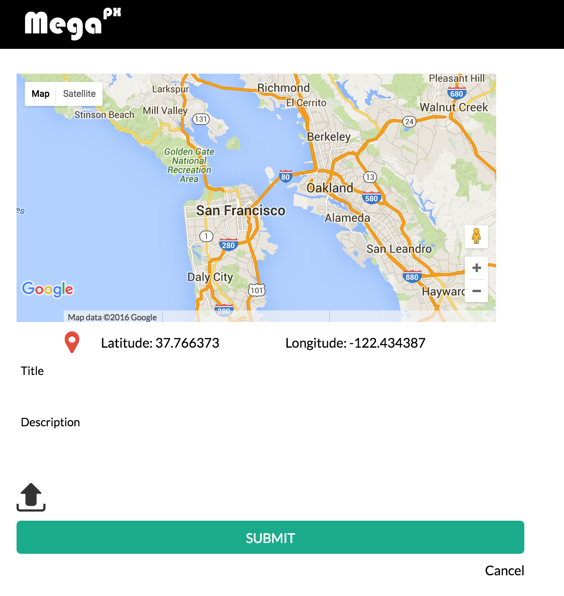

# MegaPx
[MegaPx live][heroku]
[heroku]: https://mega-px.herokuapp.com/

MegaPx is a full stack, single page application, modeled after the popular online photography network 500px. In the backend and database level, MegaPx runs on Rails with PostgreSQL as its database. On the frontend, it uses React.js exclusively and architecture is designed under the uni-directional data flow principle of Flux.

## Features & Implementation

### Single-Page
MegaPx is a single page application, which means that throughout the duration of user visitation, the website does not redirect nor refresh; everything happens on the same page. Upon changes and interactions, the page will swap out components and re-render the page with the updated content. The process of re-rendering has enabled MegaPx to deliver a smooth user experience.

Before log in
![hash_history]
After log in
![hash_history_after]
The hash history changed, but the URL did not. The page did not go anywhere. However, the whole content has swapped after user logged in.

[hash_history]: ./docs/screenshots/before-log-in.png
[hash_history_after]: ./docs/screenshots/after-log-in.png

Entire application comes down to one static page which we called root
``` html
<div id="application">
  Single-page React WebApp
</div>
```
During session, React will inject content into this html `<div>` element to create dynamic contents

``` javascript
var App = React.createClass({
  render: function() {
    console.log("App Page is rendering");
    return (
      <div>
        {this.props.children}
      </div>
    );
  }
});
```

### CRUD
Starting with the basics, MegaPx has the basic CRUD (Create, Read, Update, and Delete) functionality for user accounts, photos, and comments. User can sign up and log in. Their information will persist in the database (in a secured way.) Account password is encrypted with the blowfish hash function and stored as password digest in the database.

### Discover
MegaPx delivers location-based content. It integrates Google map and browser's built-in JavaScript navigator to fetch photos that were taken/uploaded within users' geographical area. Users also have
the option to navigate themselves to anywhere in the world to look at others' works.
The upper left hand corner is the toggle map button. When toggled, it brings up a Google Map with markers that indicate where the photos were taken.

![discover]
[discover]: ./docs/screenshots/discover.png
The app will also give users a list of suggested locations to go to. These locations are typically seeded with data. However, in the future updates, the suggestion bar will be dynamically generated by the popularities of regions.

``` javascript
generatePopularLocations: function() {
  var self = this;
  return (
    Object.keys(LocationConstants).map(function(key){
      return (
        <div className="location-item"
          title="This is a popular location, click to go"
          value={key} onClick={self.clickHandler}>
          {LocationConstants[key].name}
        </div>
      );
    })
  );
}
```
Potentially, the LocationConstants will be a function of user upload activities. Every region will receive a ranking based on how many uploads and likes occur. The ranking will then be used to populate the suggestion bar on the front discover page.

### MyPhotos
As previously mentioned, this is a CRUD app. Users can upload their photos. It's done by clicking the upload button in the upper right hand corner. Users can also manage their own photos. They can go to the MyPhotos page to look at photos they have uploaded. They can also delete them.

</img>

![myphotos]
[myphotos]: ./docs/screenshots/my-photos.png

### Incoming Features
* Tag: Photos shall receive hash tags
* Search bar
* Users can upload/update/delete their avatars
* Extract Lat/Lng from EXIF data of the photos
